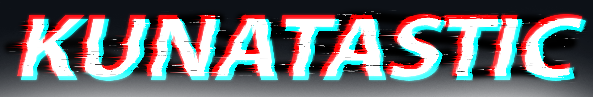

# Hello, People! 

I am Kunal Kumar Jha and I'm a 2nd Year undergraduate student at Vellore Institute of Technology, Chennai. I am interested in full stack developement, competitive programming and Cyber Security.

Most of all I ❤️ to Design things. The time I'm not coding, I'm surfing [Unsplash](https://unsplash.com/) or [Pexels](https://www.pexels.com/) for composites or Manupulating them😏.

## 🤵 About Me

- 🌱 I’m read Tech Blogs Everyday.
- 🤔 I code almost everyday.
- 💬 I know Hindi and English.
- ⚡ More than happy to discuss and work on Web Development

## 🔧 Technologies.

#### Programming Languages

#### Front-End

#### Others

## 📈 Statistics

  

